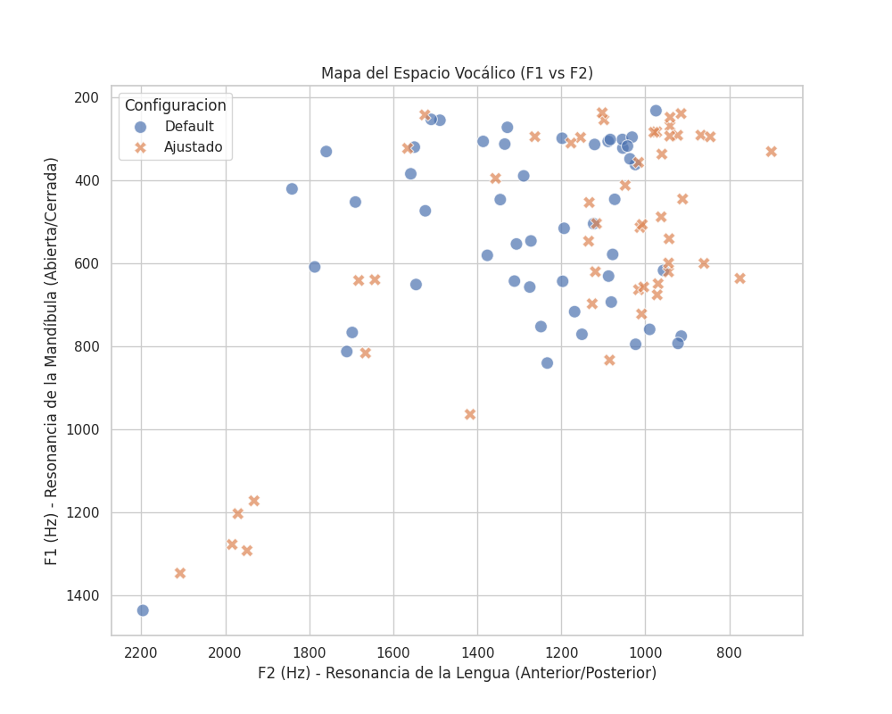
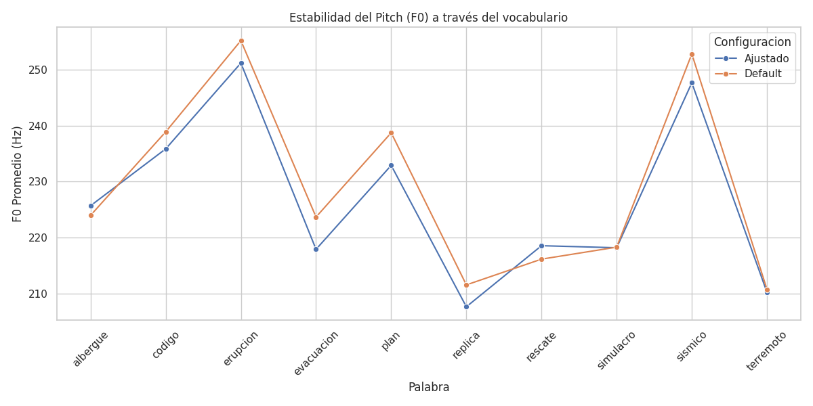
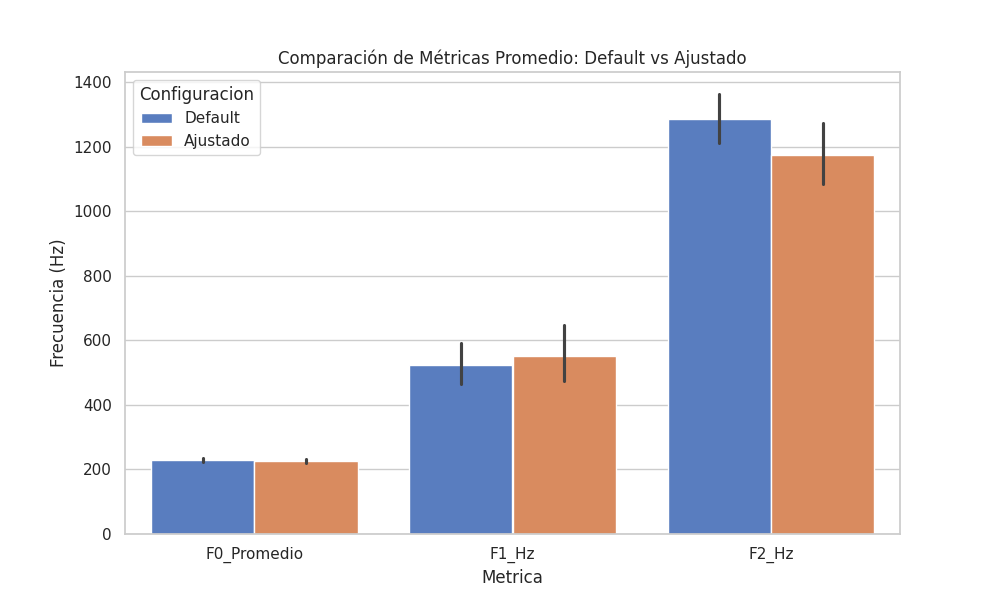

# Acoustic Analysis and Characterization of Voice Biosignals: A Case Study of a Female Speaker in Early Adulthood

**Author:** Ashley Dafne Aguilar Salinas ([ashleyd.aguilars@inaoep.mx](mailto:ashleyd.aguilars@inaoep.mx))  
**Project Directors:** 
Dr. Carlos Alberto Reyes García ([kargaxxi@inaoep.mx](mailto:kargaxxi@inaoep.mx)) 
Dr. Alejandro Antonio Torres García ([alejandro.torres@ccc.inaoep.mx](alejandro.torres@ccc.inaoep.mx)) 

---

This study presents the acoustic characterization of a 22-year-old female voice through the systematic extraction of biosignal descriptors using an integration of Praat and the `parselmouth` library in Python. Fifty segmented samples of an emergency vocabulary, captured at a sampling rate of 8000 Hz, were processed. The objective was to contrast the accuracy of parameter extraction under standard configurations versus technically grounded adjustments.

The methodology included comparing the fundamental frequency ($F_0$), formants ($F_1, F_2$), MFCC, and LPC coefficients, applying the Nyquist limit (4000 Hz) to optimize resonance detection. The results demonstrate that, while $F_0$ tracking remains robust and aligns with ranges reported in the literature for young women (Zraick et al., 2021), the accuracy of higher formants depends critically on adjusting the search ranges and linear prediction order. This work validates an automated workflow that ensures technical fidelity and anatomical coherence when analyzing bandwidth-limited voice signals.

## Usage Guide

This project relies on **uv**, a Python package manager that automatically handles virtual environments and dependencies.

### Installation of uv
If `uv` is not installed on your system, it can be acquired with a single command:

*   **macOS / Linux:**
    ```bash
    curl -LsSf https://astral.sh/uv/install.sh | sh
    ```
*   **Windows (PowerShell):**
    ```powershell
    powershell -c "irm https://astral.sh/uv/install.ps1 | iex"
    ```

### Execution Flow

The general workflow was designed to isolate the analysis from the source code, deriving its execution from configuration files with the `.ini` extension. To perform the processing, execute the following in your terminal:

```bash
uv run main.py <archivo_de_configuracion.ini>
```

For instance, you can run your script using both the main configuration and the default configuration to observe variations in the outcomes, as follows:
```bash
uv run main.py configuraciones.ini
uv run main.py configuraciones_default.ini
```

### Parameter Customization

The system is designed so that all analytical parameters (such as Pitch thresholds, Formant maxima, LPC order, and MFCC coefficients) can be altered by directly editing `configuraciones.ini` or `configuraciones_default.ini`. 

Alternatively, new `.ini` files can be created using these existing files as a "skeleton" base. You only need to copy the structure and adjust the data to your requirements without modifying the original tests; simply specify your new file to `main.py` upon execution.

## Results Analysis and Conclusions

Two systematic executions were carried out, producing two datasets stored in the `resultados/` directory: `resultados_analisis_default.csv` and `resultados_analisis_ajustado.csv`. These represent Praat's raw default analysis versus a parametric adjustment in search minimums and spectral ranges. Upon reviewing the tabulated CSV data and their respective generated graphs, the following findings were identified:

### 1. Significant Alteration of Formants (F1 and F2)
Adjusting the maximum vocal tract ceiling (`maximum_formant`) from `5500.0` Hz to `4000.0` Hz (considering the Nyquist Theorem for recordings sampled at 8000 Hz) yielded a highly noticeable difference in formant estimation. The *Burg* algorithm redirected its estimations, shifting the spectral localization of the resonances. This demonstrates that formant estimations scatter erroneously when the anatomical proportions and cutoff frequency limitations of the original recording are not previously adapted.

  
*Relational F1 vs F2 map displaying the radical graphical relocation of formants between the default and adjusted configurations.*

### 2. Refined Pitch Precision (F0)
Increasing the floor limit (`pitch_floor` from 75 to 100 Hz) prevented the F0 estimator from incorporating undesired frequencies that usually correspond to severe environmental noise or false voice sub-harmonics rather than the speaker's true fundamental tone.

  
*Vocabulary-wise linear comparison evidencing a subtle variation in Pitch frequency estimation after cleaning the minimum analysis range.*

### 3. Independence and Summary of Average Metrics
Finally, when contrasting both outputs, the observed metrics for volumetric and compound variables (such as *Intensity* and *MFCC*) resulted entirely numerically identical despite the alterations injected into their surrounding spectral analysis layers (Pitch/Formant Margin). This verifies the strong technical and granular independence of individual transformations when employing Parselmouth.

The absolute summary of the averages is as follows:

  
*Consolidated averages graph comparing the three main processed frequencies side by side. The stark parametric divergence in high formants (F1/F2) is drastically illustrated.*
